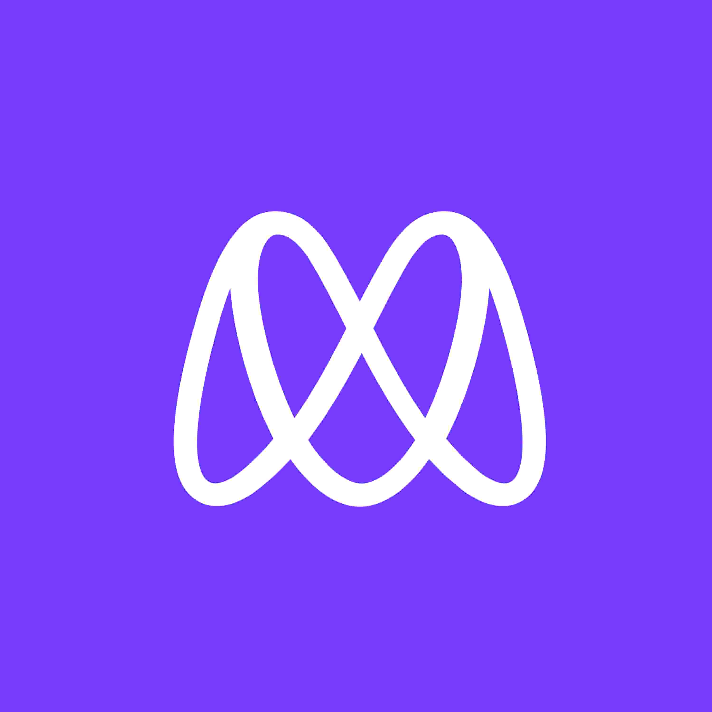

  
   

  <h3><b>Microverse README Template</b></h3>

<!-- TABLE OF CONTENTS -->

# 📗 Table of Contents

- [📖 About the Project](#about-project)
  - [🛠 Built With](#built-with)
    - [Tech Stack](#tech-stack)
    - [Key Features](#key-features)
  - [🚀 Live Demo](#live-demo)
- [💻 Getting Started](#getting-started)
  - [Setup](#setup)
  - [Prerequisites](#prerequisites)
  - [Install](#install)
  - [Usage](#usage)
  - [Run tests](#run-tests)
  - [Deployment](#triangular_flag_on_post-deployment)
- [👥 Authors](#authors)
- [🔭 Future Features](#future-features)
- [🤝 Contributing](#contributing)
- [⭐️ Show your support](#support)
- [🙏 Acknowledgements](#acknowledgements)
- [❓ FAQ](#faq)
- [📝 License](#license)

<!-- PROJECT DESCRIPTION -->

# 📖 Microverse Course 

> This project has two pages. In the home page you can find about teachers, programs, and partners. In the about page you can find about the course.

## 🛠 Built With 

### HTML, CSS, and JavaScript 

> HTML, CSS, and JavaScript are tools that web developers use to add text, photos, and videos, and also to design a website

  
Client

  <ul>
    <li><a href="https://reactjs.org/">React.js</a></li>
  </ul>

  
Server

  <ul>
    <li><a href="https://expressjs.com/">Express.js</a></li>
  </ul>

Database

  <ul>
    <li><a href="https://www.postgresql.org/">PostgreSQL</a></li>
  </ul>

<!-- Features -->

### Key Features 

> The key features of this application:

- **My informations**
- **My works**

(<a href="#readme-top">back to top</a>)

## 🚀 Live Demo 

> You can have access to my project online by clicking on the below link:

- [Live Demo Link](https://batoorsohail.github.io/microverse-course/index.html)

(<a href="#readme-top">back to top</a>)

<!-- GETTING STARTED -->

## 💻 Getting Started 

> If you want to use my project you should clone it into your computer and then open it in your code editor.

To get a local copy up and running, follow these steps.

### Prerequisites

In order to run this project you need:
- GitHub 
- Install Git 
- Code Editor

<!-- AUTHORS -->

## 👥 Authors 

👤 **Author1**

- GitHub: [@githubhandle](https://github.com/batoorsohail)
- Twitter: [@twitterhandle](https://www.linkedin.com/in/sohail-batoor-52429b230/)
- LinkedIn: [LinkedIn](https://twitter.com/sohailBatoor)

(<a href="#readme-top">back to top</a>)

<!-- FUTURE FEATURES -->

## 🔭 Future Features 

- [ ] **Program**
- [ ] **Join**
- [ ] **News**

(<a href="#readme-top">back to top</a>)

<!-- CONTRIBUTING -->

## 🤠Contributing 

Contributions, issues, and feature requests are welcome!

Feel free to check the [issues page](../../issues/).

(<a href="#readme-top">back to top</a>)

<!-- SUPPORT -->

## ⭐️ Show your support 

This project is the second project that I make. If you like my project please give it a Star.

(<a href="#readme-top">back to top</a>)

<!-- ACKNOWLEDGEMENTS -->

## 🙠Acknowledgments 

I would like to thank Microverse for helping me to complete this project

(<a href="#readme-top">back to top</a>)

<!-- FAQ (optional) -->

## ❓ FAQ 

> Add at least 2 questions new developers would ask when they decide to use your project.

- **Can we clone it without Git?**

  - No, you should install Git.

- **Which programs did you use to make this?**

  - HTML, CSS and JavaScript

(<a href="#readme-top">back to top</a>)

<!-- LICENSE -->

## 📠License 

This project is [MIT](./LICENSE) licensed.

_NOTE: we recommend using the [MIT license](https://choosealicense.com/licenses/mit/) - you can set it up quickly by [using templates available on GitHub](https://docs.github.com/en/communities/setting-up-your-project-for-healthy-contributions/adding-a-license-to-a-repository). You can also use [any other license](https://choosealicense.com/licenses/) if you wish._

(<a href="#readme-top">back to top</a>)

